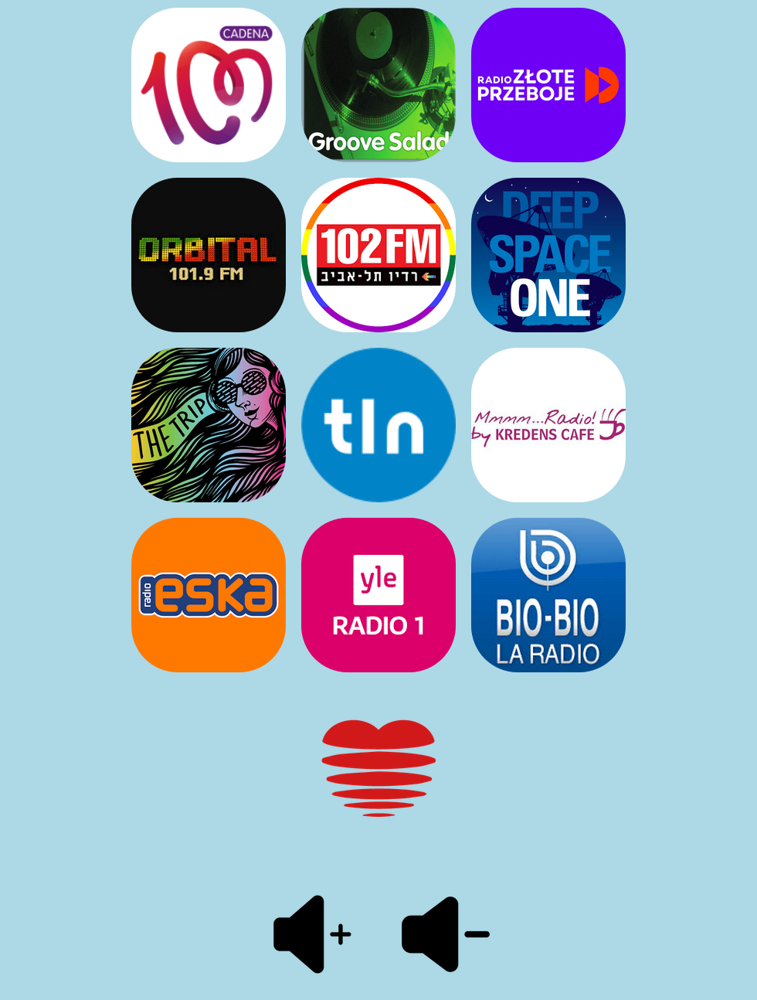

### Player app for listening internet radio streams on Raspberry Pi Zero (W) with an external bluetooth speaker
See the blog post about this app https://msergo.github.io/2022/09/10/internet-radio-pi-zero.html  



### Features
* Extremely lightweight, built with bottle.py library
* Can play "classic" streams and streams from m3u8 playlists
* Can be configured as a *systemd* service in order to start automatically

### Setting up
#### Find and pair the bluetooth speaker (tested with JBL Flip 2)
```bash
$ bluetoothctl scan on
Discovery started
[CHG] Controller 22:11:F9:18:8C:C8 Discovering: yes
[NEW] Device D8:9C:67:B4:33:18 SOME_OTHER_DEVICE
[NEW] Device B8:08:EB:7A:AC:C3 SPEAKER_HERE
# pair the SPEAKER_HERE device
bluetoothctl pair "B8:08:EB:7A:AC:C3"
bluetoothctl trust "B8:08:EB:7A:AC:C3"
```

#### Install PulseAudio Bluetooth profile loader

```bash
$ sudo apt install pulseaudio-module-bluetooth
# add pi user to bluetooth group
$ sudo usermod -a -G bluetooth pi
```
#### Install bluez-alsa

```bash
$ sudo apt install pulseaudio-module-bluetooth
$ sudo apt-get install bluealsa
$ vi ~/.asoundrc
# add the default config
defaults.bluealsa.service "org.bluealsa"
defaults.bluealsa.device "XX:XX:XX:XX:XX:XX" # MAC of the speaker
defaults.bluealsa.profile "a2dp"
defaults.bluealsa.delay 10000 
```

#### Verify it works
```bash
$ sudo apt install mplayer
$ mplayer -softvol -vo null -ao alsa:device=bluealsa file_example.wav 
```

#### Run the app
NB!: tested with python version 3.8
```bash 
virtualenv -p /usr/bin/python3.8 env
. env/bin/activate
pip install -r requirements.txt
python main.py 
```


#### Configuring as a systemd service 
##### 1. Create file /etc/systemd/system/mplayer-pi.service
```
[Unit]
Description=mplayer-pi service

[Service]
User=pi
WorkingDirectory=/path/to/mplayer-pi
ExecStart=/path/to/mplayer-pi/env/bin/python3 -m main

[Install]
WantedBy=multi-user.target
```
##### 2. Enable service
```bash
systemctl enable mplayer-pi.service
```
##### 3. Start service
```bash
systemctl start mplayer-pi.service
```

### TODO:
* improve UI (WIP)

### Images credits:
* google.com
* radio station web portals